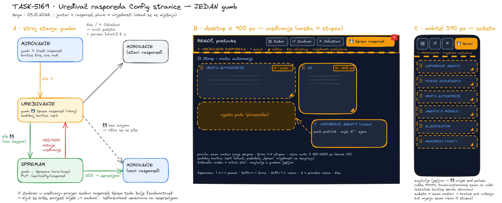

# Dizajn: uređivač rasporeda Config stranice

**Zadatak:** TASK-5169 · **Projekt:** PRJ-048 (TaskManagerAI) · **Autor:** Grga (dizajn) · **Datum:** 03.10.2026.
**Nalog (Goran, 03.10.2026. 16:50):** „Config stranicu napraviti da se može izravno uređivati drag and drop: da mogu
razmještati okvire i napraviti ih većim ili manjim kroz jednostavan uređivač. Jedan gumb: kad ga stisnem, mogu
uređivati config; kad napravim izmjene, stisnem isti gumb i to je spremanje."

**Status:** dizajn i radni prototip su gotovi i testirani. Ugradnja u TaskWebUI (pogon i paket) **nije** dio ovog
zadatka. To je sljedeći zadatak u lancu (Jelena → Potjeh, pravilo 25), opisan u §9.

**Ugrađeno (TASK-5170, 04.10.2026.):** pogon i paket — `src/core/ConfigRaspored.ts`, `src/ConfigRasporedUredivac.js`,
`GET/PUT /api/config/raspored`, e2e `tests/e2e/config_raspored_e2e.py`. Odstupanja od prototipa: kut ◢ je PRVO
dijete kartice (zadnje bi srušilo postojeći `overflow-x` sadržaja, izmjereno 683 px na 390); novi `pointerdown` i `blur`
otkazuju zaglavljeno vučenje; klijent validira prije slanja.

---

## 0. Odluke na jednom mjestu

| Pitanje | Odluka | Zašto |
|---|---|---|
| Što uređuje gumb | **Samo raspored** (redoslijed, širinu i visinu okvira). Vrijednosti postavki ostaju zaključane dok je uređivanje otvoreno. | Kartice već imaju vlastite „Spremi" gumbe s validacijom. Kad bi jedan gumb spremao i raspored i vrijednosti, jedan bi klik zaobišao pravila koja vrijednosti štite (zahtjev 4). |
| Gumb | Jedan, s prebacivanjem stanja: **✎ Uredi raspored** ↔ **💾 Spremi raspored**. Uz njega se u uređivanju pojavljuju tri sporedna gumba: ✕ Odustani, ↺ Zadano, ▤ Sažmi. | Goranov „jedan gumb" je prekidač stanja. Sporedni gumbi postoje samo dok traje uređivanje i nikad ne spremaju. |
| Boja uređivanja | **Jantar** (`#f59e0b`). Plava ostaje boja vrijednosti. | Na prvi se pogled vidi što pripada rasporedu, a što postavci. |
| Kamo kartica smije | **Samo unutar svoje skupine** (01–05) | Navigacija „01 Strop i vrata … 05 Sustav" i naslovi skupina ostaju istiniti. |
| Širina | Mreža od **4 stupca**, kartica zauzima 1–4. Zadano je 2, a `info-full` zauzima 4. | Danas je mreža 2×1fr, pa se zadani izgled ne mijenja ni za piksel. |
| Visina | `auto` (zadano) ili **160–1200 px u koracima od 40**. Višak sadržaja dobiva vlastiti klizač. | Koraci čine raspored urednim, a granice sprječavaju okvir od 5 px ili 5000 px. |
| Opseg spremanja | **Globalno**, jedan raspored za sustav | Ploča nema korisničke račune (`by` je slobodan niz), radi jedan operater, a telefon i računalo moraju vidjeti isto. |
| Gdje se sprema | Tablica `settings`, ključ **`config.raspored`** (JSON). Svaka promjena dobiva redak u **`settings_history`** sa `source='config-raspored'`. | Isti obrazac i audit kao `agents.max_concurrent` i pragovi autonomije. |
| Vraćanje na zadano | ↺ Zadano (pregled) pa 💾 Spremi. Šalje se `{zadano:true}`, ključ se briše, a povijest bilježi „→ zadano". | Zadani raspored je HTML, pa se u bazi ne čuva nikakav prazan predložak. |
| Tehnika | Pointer Events, bez biblioteka i bez HTML5 Drag-and-Drop API-ja. Logika ima 105 redaka, uređivač 280, a CSS ~55 pravila. | Jedan put za miš, dodir i olovku, jednako u Geckou i Blinku. HTML5 DnD na dodiru ne postoji. |

Skica (stroj stanja, desktop i mobitel): `docs/skice/config-raspored/uredivac-rasporeda.png`
(izvor `.excalidraw`, generator `gen_skica.py`).



---

## 1. Postojeće stanje (snimljeno uživo 03.10.2026.)

Snimke su `skice/config-raspored/snimka-pogon-1366.png` i `snimka-pogon-420.png`. Mreža je `#info-grid`,
`grid-template-columns: repeat(2, minmax(0,1fr))`, ispod 900 px jedan stupac.

**Pogon (TaskManagerMD): 5 skupina i 21 kartica.**

| Skupina | Kartice (ID → naslov) |
|---|---|
| 01 Strop i vrata autonomije | `info-concurrency-card` Usporedni agenti (1–10) · `info-hindsight-card` Usporedni pozivi Hindsighta (1–10) · `info-autonomija-card` Vrata autonomije |
| 02 Agenti i modeli | `info-agents-card` · `info-classifier-card` · `info-hindsight-model-card` · `info-memorija-card` Memorija (test) · `info-modelsetup-card` |
| 03 Integracije | `info-login-card` · `info-dezurni-card` · `info-ulaz-card` |
| 04 RAG | `info-rag-card` |
| 05 Sustav i verzija | `info-system-card` · `info-providers-card` · `info-infra-card` · `info-databases-card` · `info-metrics-card` · `info-modules-card` · `info-components-card` · `info-skills-card` · `info-rules-card` |

**Samostalni paket (TaskManagerAI) ima drukčiji skup od 21 kartice.** Ima i `info-orkestrator-card`,
`info-telegram-card` i `info-integracije-card`, a nema Hindsight i Memoriju. Dizajn zato ne smije ovisiti o popisu kartica:
radi s bilo kojim `#info-grid > .info-card[id^=info-]`, a spremljeni ID koji na stranici ne postoji tiho preskače (§5).

**Izmjereni problem rasporeda** (1366 px, `zivo_layout.json`): u mreži 2×1fr visinu retka određuje najviša kartica.
„Vrata autonomije" (½, 502 px) zato ostavljaju praznu rupu desno od sebe, a „System" i „AI Providers" stoje u retku od
597 px, iako je „Infrastructure" visoka 218 px. Upravo to Goran želi moći popraviti sam.

---

## 2. Jedan gumb: stroj stanja

```
MIROVANJE ──klik ✎──▶ UREĐIVANJE ──klik 💾 (ima izmjena)──▶ SPREMAM ──200──▶ MIROVANJE (novi raspored)
   ▲                    │   │                                   │
   │                    │   └─klik 💾 (nema izmjena) → izlaz,   └─400/409──▶ ostaje UREĐIVANJE + crvena poruka
   │                    │     NIŠTA se ne zapisuje (ni audit)
   └──Esc / ✕ Odustani──┘  → vraća početni raspored + poruka „Poništeno: N izmjena  [Vrati]" (6 s)
```

| Stanje | Natpis gumba | Ostalo |
|---|---|---|
| Mirovanje | `✎ Uredi raspored` (jantarni obrub) | Kartice žive, „Osvježi" je vidljiv. |
| Uređivanje | `💾 Spremi raspored`, puna jantarna podloga, crvena značka s brojem izmjena | Pojavljuju se ✕ Odustani, ↺ Zadano i ▤ Sažmi. „Osvježi" se skriva. `aria-pressed="true"`. |
| Spremanje | `… Spremam`, `aria-busy="true"` | Novi klik se ignorira, pa nema dvostrukog upisa. |

- **Esc** usred vučenja otkazuje samo to vučenje. Esc bez vučenja radi isto što i Odustani.
- **„Vrati"** u poruci nakon Odustani vraća točno onaj nacrt koji je odbačen i ponovno otvara uređivanje.
  Pogrešan Esc tako ne briše pet minuta rada.
- **`beforeunload`** upozorava ako se stranica zatvara s nespremljenim izmjenama.
- Broj na znački prebraja svaku promijenjenu širinu, visinu i pomaknuto mjesto, pa korisnik zna je li uopće išta dirnuo.

## 3. Vizualni znak da je uređivanje aktivno

Uređivanje stranicu pretvara u **crtaći stol**. Znakovi su slojeviti, pa ga je nemoguće ne primijetiti, a ništa ne viče:

1. **Zaglavlje s gumbom postaje ljepljivo** (`position: sticky`), s jantarno-crnom „građevinskom trakom" na donjem rubu.
   „Spremi" je tako uvijek pod prstom. Stranica je na 420 px visoka 16 000 px, pa bi bez toga gumb nestao nakon prvog
   pomaka.
2. U zaglavlju je uputa: `✎ UREĐIVANJE RASPOREDA · ⠿ povuci · ◢ kut za veličinu · Esc odustaje · vrijednosti su zaključane`.
   Na mobitelu ostaje samo prvi i zadnji dio.
3. Iza mreže se pojavljuje **točkasta mreža** od 20 px, tj. vodilice.
4. Svaka kartica dobiva **isprekidani jantarni okvir** (pun na hover ili fokus), **ručku ⠿** u naslovu, **kut ◢** dolje
   desno i **značku mjere** (`½ · auto`, `¼ · 240 px`). Značka promijenjene kartice postaje puna jantarna.
5. Sadržaj kartica je na 55 % prozirnosti i `inert`: vidi se što je u okviru, ali ništa se ne može dirnuti (§6).

Snimke prototipa: `proto_firefox_1440_mirovanje.png`, `proto_firefox_1440_uredivanje.png`,
`proto_chromium_1440_mijenjam.png` (resize u tijeku) i `proto_firefox_390_uredivanje.png`.

## 4. Interakcija

### 4.1 Premještanje (drag & drop)
- Vuče se **samo za ručku ⠿** (44×44 px, `touch-action: none`). Ostatak kartice na dodir normalno pomiče stranicu,
  pa uređivanje ne „otima" skrolanje.
- Kartica koja se vuče prati pokazivač (`position: fixed`, sjena, nagib 0,6°). Na njezinu mjestu stoji
  **isprekidano mjesto pada** iste širine i visine, pa se točno vidi kamo će sletjeti.
- Cilj se određuje karticom pod pokazivačem i dijagonalom kroz nju: `(x/š + y/v) < 1` znači „ispred", inače „iza".
  To radi i za kartice jednu do druge i za kartice jednu ispod druge.
- **Autoskrol:** 80 px od gornjeg ili donjeg ruba prozora stranica se kotrlja, i to brže što je pokazivač bliže rubu.
- Kartica iz druge skupine nije cilj. Mjesto pada tada ostaje na zadnjoj valjanoj poziciji.
- Kartice se **fizički premještaju u DOM-u**, bez CSS `order`. Tab-redoslijed i čitač ekrana zato prate ono što se vidi.
  Postojeći rendereri (`#info-*-content`) nalaze svoje okvire po ID-u, pa ih premještanje ne smeta.

### 4.2 Promjena veličine
- Vuče se **kut ◢**. Širina skače po stupcima (1–4), a visina po 40 px (160–1200). Značka se ažurira uživo.
- Prag od 8 px: drhtaj prsta ne pretvara `auto` u fiksnu visinu.
- **Dvoklik na kut** vraća prirodnu visinu (`auto`).
- Na **mobitelu** (jedan stupac) kut mijenja samo visinu. Spremljena širina vrijedi za desktop i ostaje netaknuta.
- Između 900 i 1199 px kartica od ¼ crta se kao ½, jer je četvrtina tu preuska za klizač. Spremljena vrijednost ostaje ¼.

### 4.3 Tipkovnica (isti posao bez miša i prsta)
U uređivanju je svaka kartica fokusabilna (`tabindex=0`, `aria-roledescription="pomična kartica"`).
`↑/←` i `↓/→` pomiču karticu u skupini, `Shift+←/→` mijenjaju širinu, `Shift+↑/↓` visinu za ±40 px, `A` vraća
prirodnu visinu, a `Esc` odustaje. Svaka promjena se najavljuje kroz `aria-live`, npr. „Vrata autonomije: mjesto 1 od 3,
širina ½, visina prirodna".

### 4.4 Sažeto (▤)
Prikazuju se samo naslovi kartica, pa se 16 000 px mobilne stranice svodi na jedan do dva ekrana i premještanje postaje
kratko. **Na mobitelu se uključuje samo** pri ulasku u uređivanje, a na desktopu je isključeno. U sažetom se visina
ne mijenja jer se ne vidi.

### 4.5 Mobitel (dodir)
- Zaglavlje u uređivanju ima jedan red: tri gumba-ikone od 44×44 (aria-label je puni naziv) i `💾 Spremi raspored`
  preko ostatka širine. Naslov stranice se za vrijeme uređivanja skriva.
- `touch-action: manipulation` i `-webkit-tap-highlight-color: transparent` na gumbima.
- Nema vodoravnog preljeva na 390 px (izmjereno: `scrollWidth = 390`). Prva verzija prototipa je preljevala na 438 px
  jer se red gumba nije prelamao, a test je to uhvatio.

## 5. Model podataka, spremanje i API

### 5.1 Vrijednost ključa `config.raspored`
```json
{ "v": 1,
  "redoslijed": ["info-autonomija-card", "info-concurrency-card", "info-hindsight-card", "…"],
  "kartice": { "info-autonomija-card": { "w": 2, "h": null }, "info-hindsight-card": { "w": 1, "h": 240 } } }
```
- `redoslijed` je ravan popis. Skupina se **ne sprema**, nego se uzima iz HTML-a. Tako raspored ne može premjestiti
  karticu u drugu skupinu ni kad netko ručno napiše JSON.
- **Spajanje s HTML-om** (`poredajSkupinu`): kartice koje raspored poznaje popunjavaju svoja mjesta spremljenim redom.
  **Nova kartica** (iz nadogradnje) ostaje na svom zadanom mjestu, a **nestali ID** se preskače.
- **Spremanje čuva nevidljive ID-jeve** (`spoji`): ako se pogon i paket ikad posluže iz iste baze, nijedan ne briše
  raspored drugoga.

### 5.2 Validacija na poslužitelju (`validiraj`, stroga: sve ili ništa)
| Pravilo | Odbija se |
|---|---|
| Najviša razina smije imati samo `v`, `redoslijed`, `kartice` | npr. `maxConcurrent`: **raspored ne nosi vrijednosti postavki** |
| `v === 1` | druge verzije |
| ID odgovara `^info-[a-z0-9-]{1,60}-card$` | selektori, HTML, `../`, `tab-info` |
| Nema ponovljenih ID-jeva; najviše 64 kartice | |
| `w` je cijeli broj 1–4; `h` je `null` ili cijeli broj 160–1200 djeljiv s 40 | `w=9`, `h=330`, `h="320"`, dodatna polja u mjerama |
| Tijelo ≤ 8192 B | prevelik JSON |

### 5.3 API (novo)
| Metoda | Tijelo | Učinak |
|---|---|---|
| `GET /api/config/raspored` | — | `{ raspored: <JSON ili null>, osnova: <updated_at ili null>, povijest: [zadnjih 10] }` |
| `PUT /api/config/raspored` | `{ raspored, osnova, by, source:"config-raspored" }` | validacija → upis ključa i redak u `settings_history` **u istoj transakciji** → WS `raspored_changed` |
| `PUT /api/config/raspored` | `{ zadano: true, osnova, by }` | briše ključ; povijest bilježi `new_value = "zadano"` |

- **`osnova`** je `updated_at` viđen pri ulasku u uređivanje. Ako je raspored u međuvremenu spremio netko drugi (drugi
  uređaj), poslužitelj vraća **409**. Uređivanje tada ostaje otvoreno, a poruka glasi „Raspored je u međuvremenu
  promijenjen na drugom uređaju — Odustani pa uredi ponovo."
- Spremanje bez izmjena **ne šalje zahtjev**, pa se audit ne zatrpava praznim retcima.
- Pri učitavanju stranice raspored se dohvaća **prije prvog iscrtavanja mreže** (ili se mreža do odgovora drži
  `visibility:hidden`, najviše 300 ms), da kartice ne skaču.
- Druga otvorena stranica na WS `raspored_changed` primjenjuje novi raspored, ali **ne dok je u uređivanju** (tamo
  čeka 409).

## 6. Uređivanje rasporeda ne smije dirnuti vrijednosti (zahtjev 4): četiri neovisna sloja

1. **Zasebna ruta i ključ.** `PUT /api/config/raspored` piše isključivo ključ `config.raspored`. Postojeće rute
   (`/api/config/concurrency`, `/autonomy`, `/hindsight`, `/memorija`) i njihova validacija ostaju **netaknute** i
   jedini su put do vrijednosti.
2. **Stroga validacija.** Svako polje izvan `v/redoslijed/kartice/w/h` daje 400 (§5.2, test „polje vrijednosti uz
   raspored se odbija cijelo").
3. **UI je fizički zaključan.** U uređivanju sadržaj svake kartice ima `inert` i `pointer-events: none`. Klizač,
   prekidač i „Spremi" vrijednosti ne primaju ni klik ni tipku. E2E to provjerava stvarnim klikom na klizač
   „Usporednih agenata", a vrijednost ostaje `2→2`.
4. **Test nepromjenjivosti za ugradnju** (Jelena/Potjeh): snimiti `GET` sve četiri rute vrijednosti → `PUT` raspored
   (i valjan i nevaljan) → ponoviti `GET`. Odgovori moraju biti **bajt-identični**, a novi retci u `settings_history`
   smiju imati samo `key='config.raspored'`.

Pravilo 21 time ostaje netaknuto: strop usporednih agenata i dalje se mijenja na kartici „Usporedni agenti (1–10)"
uživo i bez restarta. Uređivač rasporeda tu karticu samo premješta.

## 7. Pristupačnost
- Gumb ima `aria-pressed` i `aria-busy`, a sporedni gumbi-ikone imaju `aria-label`.
- Premještanje i mjere najavljuju se kroz `aria-live` (sr-only).
- Sve što radi mišem radi i tipkovnicom (§4.3); fokus ostaje na pomaknutoj kartici.
- Ciljevi dodira su ≥ 44×44 px (provjereno u E2E).
- `prefers-reduced-motion` gasi prijelaze i nagib kartice.

## 8. Rubni slučajevi
| Slučaj | Ponašanje |
|---|---|
| Kartica se osvježi (WS, „Osvježi") za vrijeme uređivanja | Renderer mijenja samo `#info-*-content` unutar `inert` omotača; raspored ostaje. „Osvježi" je u uređivanju skriven. |
| Prijelaz na drugu karticu ploče usred uređivanja | Stanje ostaje (stranica se ne napušta). Pri povratku je uređivanje i dalje otvoreno. CSS je ograničen na `#tab-info`. |
| Nadogradnja doda novu karticu | Kartica ostaje na zadanom mjestu, sa zadanom mjerom. |
| Nadogradnja ukloni karticu | ID se preskače, ali u spremljenom JSON-u ostaje (spoji) dok netko ne spremi ↺ Zadano. |
| Neispravan JSON u bazi (ručno dirnut) | Klijent ga validira istom funkcijom. Ako ne prođe, crta se zadani raspored, a u konzoli ostaje upozorenje. |
| Dva uređaja spremaju istodobno | Drugi dobiva 409 (`osnova`). |
| Uređivač otvoren, spremanje padne (mreža) | Ostaje uređivanje, crvena poruka „Raspored NIJE spremljen: … — i dalje uređuješ." |

## 9. Plan ugradnje (sljedeći zadatak u lancu; pravilo 25)
1. **Jelena:**
   - `src/core/ConfigRaspored.ts`: prenijeti `raspored-logika.js` u TS (Zod shema = §5.2) i dodati
     `getRaspored/setRaspored/rasporedPovijest` po uzoru na `AutonomyThresholdSetting.ts` (ista transakcija za `settings`
     i `settings_history`).
   - Rute iz §5.3 u `TaskWebUI.ts`, u **pogonu** (TaskManagerMD) i u **paketu**.
   - `uredivac.js` + CSS iz `prototip.html` u inline skriptu Config kartice. Paziti na backtick unutar HTML template
     literala (lekcija TASK-4633). CSS treba ograničiti na `#tab-info`, a jantar dodati kao `--cr-jantar` u `:root`.
   - i18n ključevi (`cfg_raspored_*`) za HR/EN.
   - Test se samo preusmjeri: `tests/config-raspored-logika.test.ts` mijenja import na `src/core/ConfigRaspored.ts`.
   - Isporuka u pogon **isključivo** kroz `restart_kad_mirno.sh <TASK-ID>` (pravilo 24), nikad restart iz vlastitog spawna.
2. **Potjeh:** `e2e_prototip.py` uperiti na pravu ploču (isti scenariji, Chromium i Firefox) i dodati test
   nepromjenjivosti iz §6.4.
3. GitHub push paketa radi **samo Goran**.

## 10. Verifikacija ovog zadatka (stvarni izlazi)

```
$ bun test tests/config-raspored-logika.test.ts
 22 pass
 0 fail
 39 expect() calls

$ cd docs/skice/config-raspored && TMPDIR=~/.tmp python3 e2e_prototip.py
== chromium desktop   18 × PASS   (miš: drag&drop, granica skupine, resize ½→¼ + 240 px, tipkovnica, Esc, Vrati,
                                   isti gumb sprema, trajnost nakon reload, bez izmjena = bez upisa, Zadano, w=9 odbijen,
                                   klizač vrijednosti inert 2→2, 0 JS grešaka)
== chromium mobitel    9 × PASS   (pravi dodir kroz CDP Input.dispatchTouchEvent)
== firefox desktop    18 × PASS   (Firefox 155, pravi Gecko)
== firefox mobitel     9 × PASS   (has_touch; vučenje sintetičkim PointerEvent pointerType=touch)
54 pass, 0 fail
```
Puni izlaz: `skice/config-raspored/e2e-izlaz.txt`.

**Granica dokaza:** Playwright za Firefox nema touch-drag gestu, pa je dodir u Geckou provjeren sintetičkim
`PointerEvent`-om (logika), a ne gestom zaslona. U Chromiumu je gesta prava (CDP). Na fizičkom telefonu (Firefox za
Android) to treba potvrditi pri ugradnji (Potjeh).

## 11. Nalaz uzgred (alat, ne stranica)
Bezglavi Chromium ruši renderer pri otvaranju Config stranice kad je `TMPDIR=/tmp`, jer je `/tmp` tmpfs od 100 MB
(81 MB zauzeto, `ENOSPC`). S `TMPDIR=~/.tmp/...` isti test ne pada (`crash=False`). Stranica nije kriva. Vrijedi za
svaku buduću Playwright provjeru ploče (CLAUDE.md pravilo 13).

## 12. Datoteke
| Datoteka | Što je |
|---|---|
| `docs/DIZAJN-config-uredivac-rasporeda.md` | ovaj dokument |
| `docs/skice/config-raspored/uredivac-rasporeda.excalidraw` / `.png` | skica: stroj stanja, desktop, mobitel |
| `docs/skice/config-raspored/gen_skica.py` | generator skice |
| `docs/skice/config-raspored/prototip.html` | radni prototip, otvara se u pregledniku preko bilo kojeg statičkog poslužitelja |
| `docs/skice/config-raspored/uredivac.js` | uređivač (280 redaka, ES5, bez biblioteka), predložak za ugradnju |
| `docs/skice/config-raspored/raspored-logika.js` | čista logika: validacija, poredak, spajanje (105 redaka) |
| `docs/skice/config-raspored/e2e_prototip.py`, `e2e-izlaz.txt` | E2E Chromium + Firefox, miš + dodir |
| `docs/skice/config-raspored/snimka-pogon-*.png`, `proto_*.png` | snimke postojećeg stanja i prototipa |
| `tests/config-raspored-logika.test.ts` | 22 testa pravila (bun test) |
